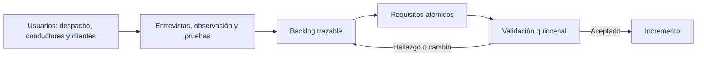
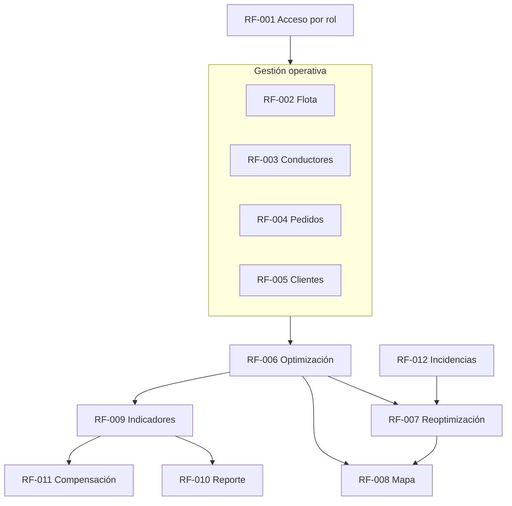

# Requisitos funcionales y elicitación holística

| Metadato | Valor |
|---|---|
| Proyecto | EcoLogística Lima — Optimización sostenible de última milla |
| Versión | 1.0.0 |
| Fecha | 04/09/2026 |
| Fuente | Consigna de proyecto, validación académica y contexto operativo de Lima Este |

## Marco de elicitación holística y ética

La elicitación considera al despachador, conductores, administración, clientes receptores y patrocinador. Se realizarán entrevistas semiestructuradas con despacho, observación de la planificación de una jornada, pruebas de prototipo con conductores y revisión de historias con el patrocinador cada dos semanas. Los hallazgos se registrarán en el backlog con fuente, prioridad y decisión.

El diseño reconoce direcciones con referencias locales, conectividad limitada, distintas capacidades digitales y jornadas de conducción. No se usarán datos personales reales en pruebas sin consentimiento; el DNI y contacto se limitan por rol, se anonimizan en ambientes no productivos y se aplica minimización de datos conforme a la Ley 29733. Las rutas son recomendaciones explicables: el operador conserva la decisión final y puede registrar una excepción.

## Catálogo y trazabilidad

| ID | Requisito atómico | Prioridad | Fuente | Regla relacionada |
|---|---|---|---|---|
| RF-001 | Autenticar usuarios y aplicar permisos por rol. | Alta | Seguridad / operación | RN-001, RN-002 |
| RF-002 | Registrar y mantener vehículos. | Alta | RF-01 del proyecto | RN-003, RN-004 |
| RF-003 | Registrar y mantener conductores y su disponibilidad. | Alta | RF-08 del proyecto | RN-005 |
| RF-004 | Registrar y validar pedidos. | Alta | RF-02 del proyecto | RN-006, RN-007 |
| RF-005 | Administrar preferencias de entrega de clientes. | Media | RF-09 del proyecto | RN-006 |
| RF-006 | Generar una solución de rutas factibles. | Alta | RF-03 del proyecto | RN-003 a RN-009 |
| RF-007 | Reoptimizar rutas ante una incidencia. | Alta | RF-07 del proyecto | RN-008, RN-009 |
| RF-008 | Visualizar rutas y alertas en el mapa. | Alta | RF-04 del proyecto | RN-010 |
| RF-009 | Consultar indicadores de operación y sostenibilidad. | Alta | RF-05 del proyecto | RN-011, RN-012 |
| RF-010 | Descargar reporte de sostenibilidad. | Alta | RF-06 del proyecto | RN-011 a RN-013 |
| RF-011 | Proponer compensación de carbono. | Media | RF-10 del proyecto | RN-012, RN-013 |
| RF-012 | Registrar incidencias y reportes de seguridad vial. | Media | Restricciones locales | RN-008, RN-010 |

## Especificación de requisitos

### RF-001: Autenticación y autorización

- **Descripción atómica:** El sistema debe autenticar a un usuario con credenciales válidas y habilitar únicamente las capacidades asignadas a su rol.
- **Prioridad:** Alta.
- **Criterios de aceptación (BDD):**

  - **Ruta Gold:** DADO un usuario activo con rol Operador, CUANDO ingresa credenciales válidas, ENTONCES accede al tablero operativo y se registra el inicio de sesión.
  - **Ruta Feliz:** DADO un Auditor activo, CUANDO se autentica, ENTONCES puede consultar reportes y auditoría sin opciones de edición.
  - **Ruta Infeliz:** DADO credenciales inválidas, CUANDO se intenta iniciar sesión, ENTONCES el sistema deniega el acceso y muestra un mensaje sin revelar cuál dato falló.

### RF-002: Gestión de flota

- **Descripción atómica:** El sistema debe crear, consultar, actualizar y desactivar vehículos con placa, tipo, capacidad en kg, consumo en km/L, factor de emisión en kg CO₂/km y año de fabricación.
- **Prioridad:** Alta.
- **Criterios de aceptación (BDD):**

  - **Ruta Gold:** DADO un Administrador, CUANDO registra una camioneta con todos los campos obligatorios y placa única, ENTONCES el vehículo queda disponible para planificación.
  - **Ruta Feliz:** DADO un vehículo existente, CUANDO el Administrador actualiza su consumo, ENTONCES los cálculos futuros usan el nuevo valor y se conserva auditoría.
  - **Ruta Infeliz:** DADO una placa existente o capacidad no positiva, CUANDO se guarda el registro, ENTONCES el sistema rechaza el campo inválido sin crear el vehículo.

### RF-003: Gestión de conductores

- **Descripción atómica:** El sistema debe registrar y actualizar conductores con nombre, DNI, licencia, experiencia, disponibilidad, contacto y punto de partida.
- **Prioridad:** Alta.
- **Criterios de aceptación (BDD):**

  - **Ruta Gold:** DADO un Administrador, CUANDO registra un conductor con licencia vigente y franja disponible, ENTONCES queda habilitado para asignación.
  - **Ruta Feliz:** DADO un conductor habilitado, CUANDO reporta disponibilidad distinta, ENTONCES el Operador puede actualizarla antes de optimizar.
  - **Ruta Infeliz:** DADO un DNI duplicado o licencia vencida, CUANDO se intenta guardar, ENTONCES se informa la validación incumplida y no se habilita la asignación.

### RF-004: Gestión de pedidos

- **Descripción atómica:** El sistema debe registrar pedidos con cliente, dirección, coordenadas o punto de referencia, peso, volumen, ventana horaria, prioridad y tipo de producto.
- **Prioridad:** Alta.
- **Criterios de aceptación (BDD):**

  - **Ruta Gold:** DADO un Operador, CUANDO ingresa un pedido con ubicación y ventana válidas, ENTONCES el pedido queda pendiente de planificación.
  - **Ruta Feliz:** DADO una dirección no estandarizada de San Juan de Lurigancho, CUANDO se registra un punto de referencia y coordenadas, ENTONCES el pedido puede planificarse.
  - **Ruta Infeliz:** DADO una hora final anterior a la inicial, CUANDO se guarda el pedido, ENTONCES se rechaza el registro indicando el campo que debe corregirse.

### RF-005: Preferencias de entrega

- **Descripción atómica:** El sistema debe permitir registrar horarios preferidos, puntos de referencia y restricciones de acceso por cliente.
- **Prioridad:** Media.
- **Criterios de aceptación (BDD):** DADO un cliente existente, CUANDO el Operador registra una preferencia válida, ENTONCES la preferencia se asocia al cliente y se propone al crear pedidos; DADO una preferencia inválida, CUANDO se intenta guardar, ENTONCES se solicita corrección.

### RF-006: Generación de rutas optimizadas

- **Descripción atómica:** El sistema debe generar rutas factibles para pedidos seleccionados considerando capacidad, ventanas de tiempo, jornada, descanso, distancia, costo, emisiones, tráfico y restricciones vehiculares configuradas.
- **Prioridad:** Alta.
- **Criterios de aceptación (BDD):**

  - **Ruta Gold:** DADO hasta 150 pedidos válidos y 15 vehículos disponibles, CUANDO el Operador solicita optimización, ENTONCES recibe rutas factibles, pedidos no asignados con causa y métricas comparativas.
  - **Ruta Feliz:** DADO pedidos de distinta prioridad, CUANDO se genera una solución, ENTONCES las restricciones de capacidad y ventana se respetan y la prioridad se incorpora a la función objetivo.
  - **Ruta Infeliz:** DADO un pedido cuya carga excede toda la flota, CUANDO se optimiza, ENTONCES se marca no asignado con motivo y no se altera una ruta válida.

### RF-007: Reoptimización dinámica

- **Descripción atómica:** El sistema debe recalcular las rutas no completadas cuando el Operador registra un nuevo pedido, cancelación, incidente de tránsito o avería de vehículo.
- **Prioridad:** Alta.
- **Criterios de aceptación (BDD):** DADO una jornada en curso, CUANDO se registra una avería, ENTONCES el sistema excluye el vehículo afectado y propone rutas para las paradas pendientes; DADO que no existe alternativa factible, CUANDO termina el cálculo, ENTONCES identifica las entregas afectadas y su causa.

### RF-008: Mapa operativo

- **Descripción atómica:** El sistema debe mostrar en un mapa cada ruta, sus paradas, tiempo estimado por tramo, nivel de congestión y alertas de seguridad configuradas.
- **Prioridad:** Alta.
- **Criterios de aceptación (BDD):** DADO una solución generada, CUANDO el Operador abre una ruta, ENTONCES visualiza trazado y secuencia de paradas; DADO tráfico no disponible, CUANDO abre el mapa, ENTONCES se muestra el último dato disponible con su hora y una advertencia.

### RF-009: Dashboard de indicadores

- **Descripción atómica:** El sistema debe calcular y mostrar distancia, CO₂, combustible ahorrado, cumplimiento de ventanas, ahorro frente a ruta secuencial y equivalente ambiental para un periodo seleccionado.
- **Prioridad:** Alta.
- **Criterios de aceptación (BDD):** DADO un periodo con rutas cerradas, CUANDO el usuario consulta el tablero, ENTONCES se muestran indicadores y unidad; DADO que no existen rutas cerradas, CUANDO consulta el periodo, ENTONCES se muestra estado sin datos sin inventar valores.

### RF-010: Reporte de sostenibilidad

- **Descripción atómica:** El sistema debe generar un archivo PDF descargable con emisiones por ruta, costo de ciclo de vida, ahorro, compensación propuesta y cumplimiento de meta de carbono.
- **Prioridad:** Alta.
- **Criterios de aceptación (BDD):** DADO un periodo con resultados, CUANDO un usuario autorizado solicita el reporte, ENTONCES descarga un PDF con fecha, filtros y fuente de parámetros; DADO un periodo sin resultados, CUANDO lo solicita, ENTONCES el sistema informa que no hay información para generar el reporte.

### RF-011: Compensación de carbono

- **Descripción atómica:** El sistema debe calcular emisiones netas del periodo y proponer cantidad de árboles o créditos de compensación según factores configurados y proyectos locales registrados.
- **Prioridad:** Media.
- **Criterios de aceptación (BDD):** DADO un factor de captura vigente, CUANDO se consultan emisiones anuales, ENTONCES el sistema muestra cálculo, factor, fecha y propuesta; DADO que falta el factor, CUANDO se solicita la propuesta, ENTONCES no publica una equivalencia y solicita configuración.

### RF-012: Incidencias de seguridad vial

- **Descripción atómica:** El sistema debe registrar una incidencia con tipo, ubicación, hora, severidad y observación para que el Operador la considere en la planificación.
- **Prioridad:** Media.
- **Criterios de aceptación (BDD):** DADO un conductor autenticado, CUANDO reporta una incidencia con ubicación y tipo, ENTONCES queda pendiente de validación; DADO datos incompletos, CUANDO envía el reporte, ENTONCES se conserva el borrador local y se indican los datos faltantes.

## Criterios de calidad del backlog

Cada requisito se revisará por atomicidad, verificabilidad, trazabilidad y ausencia de soluciones técnicas en su descripción. Las decisiones de arquitectura están documentadas en los documentos 10 al 12; no constituyen requisitos funcionales.
