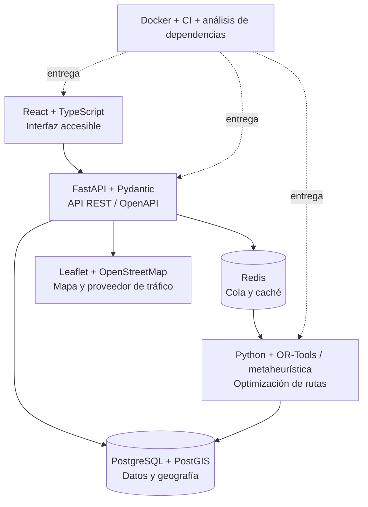

# Evaluación y selección del stack tecnológico

| Metadato | Valor |
|---|---|
| Proyecto | EcoLogística Lima |
| Versión | 1.0.0 |
| Fecha | 04/09/2026 |

## Alternativas evaluadas

Escala: 1 = desfavorable, 5 = muy favorable. Resultado = peso × puntuación.

| Criterio | Peso | A: MERN | B: FastAPI + React + PostgreSQL | C: Spring Boot + Angular + PostgreSQL |
|---|---:|---:|---:|---:|
| Adecuación a optimización y análisis | 25% | 3 | 5 | 4 |
| Curva de aprendizaje del equipo | 15% | 4 | 4 | 2 |
| Integridad y consultas geoespaciales | 15% | 3 | 5 | 5 |
| Rendimiento y asincronía | 10% | 4 | 5 | 4 |
| Costo operativo / uso eficiente de recursos | 15% | 4 | 5 | 3 |
| Ecosistema, mantenimiento y seguridad | 10% | 4 | 4 | 5 |
| Accesibilidad y UX móvil | 10% | 4 | 5 | 4 |
| **Puntaje ponderado / 5** | **100%** | **3.65** | **4.80** | **3.85** |

## Decisión arquitectónica

Se selecciona **Python/FastAPI + React + PostgreSQL con PostGIS**, complementado por Leaflet/OpenStreetMap. Python permite implementar y evaluar metaheurísticas con bibliotecas científicas; FastAPI expone una API documentada y asíncrona; PostgreSQL protege integridad transaccional y PostGIS soporta consultas espaciales. React facilita una interfaz responsive, modo conductor y componentes accesibles. Leaflet y OpenStreetMap reducen el costo del MVP; un adaptador permite incorporar un proveedor de tráfico sin acoplar el dominio.

La decisión no implica que la tecnología sustituya controles de calidad: la API usa autenticación, validación de entradas, migraciones y pruebas; la web aplica WCAG 2.1 AA. La solución se empaqueta en contenedores, con configuración por variables de entorno y despliegue escalable horizontalmente para servicios web; el optimizador se ejecuta como trabajo desacoplado.

## Stack seleccionado

| Capa | Tecnología | Responsabilidad |
|---|---|---|
| Cliente | React, TypeScript, Vite, Leaflet | UI web, accesibilidad, visualización de mapa y modo conductor. |
| API | Python 3, FastAPI, Pydantic | REST/OpenAPI, autorización, validación y orquestación. |
| Optimización | Python, OR-Tools o metaheurística implementada | VRPTW/Green VRP, comparación y reoptimización. |
| Datos | PostgreSQL 16, PostGIS | Datos transaccionales, geometrías, auditoría y resultados. |
| Caché / trabajos | Redis y cola de trabajos | Estado temporal, trabajos de optimización y reintentos. |
| Integraciones | Adaptadores para OSM/OSRM y tráfico | Rutas, geocodificación, congestión e incidentes. |
| Operación | Docker, CI, escaneo de dependencias | Reproducibilidad, pruebas y entrega. |

## Principios de eco-diseño

- Solicitar datos de mapa y tráfico solo para el área y momento requeridos; cachear resultados con vigencia.
- Paginar resultados, comprimir respuestas y entregar al tablero agregados en lugar de datos crudos.
- Medir duración de optimizaciones, consultas lentas y transferencia; revisar índices antes de aumentar infraestructura.
- Mantener un modo degradado con datos de tráfico de última actualización, en vez de repetir solicitudes fallidas.
