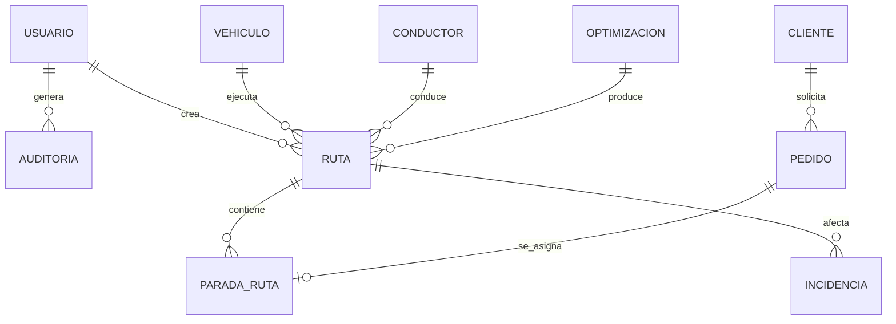
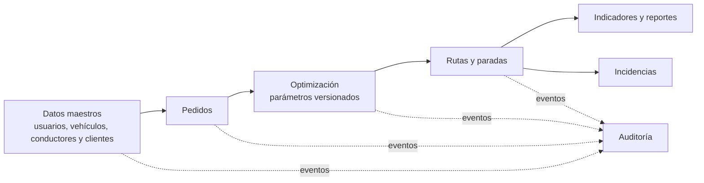

# Diseño e ingeniería de base de datos

| Metadato | Valor |
|---|---|
| Proyecto | EcoLogística Lima |
| Versión | 1.0.0 |
| Fecha | 04/09/2026 |

## Modelo conceptual



## Modelo lógico (3FN)

| Entidad | Atributos principales | Claves y propósito |
|---|---|---|
| usuario | usuario_id, email, password_hash, rol, estado | PK usuario_id; email único; acceso. |
| vehiculo | vehiculo_id, placa, tipo, capacidad_kg, capacidad_m3, rendimiento_km_l, factor_co2, anio, estado | PK; placa única; recursos de ruta. |
| conductor | conductor_id, usuario_id, dni, licencia, experiencia_anios, telefono, disponible_desde/hasta, punto_partida | PK; FK usuario; datos mínimos del conductor. |
| cliente | cliente_id, nombre, horario_preferido, referencia, restriccion_acceso | PK; preferencias de entrega. |
| pedido | pedido_id, cliente_id, direccion, ubicacion, peso_kg, volumen_m3, ventana_inicio/fin, prioridad, tipo_producto, estado | PK; FK cliente; ubicación PostGIS. |
| optimizacion | optimizacion_id, solicitada_por, estado, parametros_version, inicio/fin, objetivo | PK; FK usuario; ejecución reproducible. |
| ruta | ruta_id, optimizacion_id, vehiculo_id, conductor_id, distancia_km, tiempo_min, co2_kg, costo, estado | PK; FKs; resultado por recurso. |
| parada_ruta | parada_id, ruta_id, pedido_id, secuencia, eta, atendida_en, estado | PK; FKs; pedido asignado una vez por ruta. |
| incidencia | incidencia_id, ruta_id, reportada_por, tipo, severidad, ubicacion, ocurrida_en, estado | PK; FKs; tráfico, avería o seguridad. |
| parametro | parametro_id, codigo, valor, unidad, vigente_desde/hasta, fuente | PK; parámetros versionados. |
| auditoria | auditoria_id, usuario_id, entidad, entidad_id, accion, creado_en, detalle | PK; FK usuario; trazabilidad. |

Las entidades no repetitivas se mantienen en 3FN: preferencias pertenecen a cliente, las paradas resuelven la relación ruta-pedido y los parámetros conservan su vigencia. Los DNI y teléfonos requieren acceso restringido y nunca se exportan sin autorización.

## Modelo físico (PostgreSQL/PostGIS)

```sql
CREATE EXTENSION IF NOT EXISTS pgcrypto;
CREATE EXTENSION IF NOT EXISTS postgis;

CREATE TABLE usuario (
  usuario_id UUID PRIMARY KEY DEFAULT gen_random_uuid(),
  email VARCHAR(255) NOT NULL UNIQUE,
  password_hash VARCHAR(255) NOT NULL,
  rol VARCHAR(20) NOT NULL CHECK (rol IN ('ADMINISTRADOR','OPERADOR','CONDUCTOR','ANALISTA','AUDITOR')),
  estado VARCHAR(15) NOT NULL DEFAULT 'ACTIVO' CHECK (estado IN ('ACTIVO','BLOQUEADO','INACTIVO')),
  creado_en TIMESTAMPTZ NOT NULL DEFAULT CURRENT_TIMESTAMP
);

CREATE TABLE vehiculo (
  vehiculo_id UUID PRIMARY KEY DEFAULT gen_random_uuid(),
  placa VARCHAR(10) NOT NULL UNIQUE,
  tipo VARCHAR(20) NOT NULL CHECK (tipo IN ('CAMIONETA','FURGON','MOTO')),
  capacidad_kg NUMERIC(10,2) NOT NULL CHECK (capacidad_kg > 0),
  capacidad_m3 NUMERIC(10,2) NOT NULL CHECK (capacidad_m3 > 0),
  rendimiento_km_l NUMERIC(10,3) NOT NULL CHECK (rendimiento_km_l > 0),
  factor_co2_kg_km NUMERIC(10,5) NOT NULL CHECK (factor_co2_kg_km >= 0),
  anio_fabricacion SMALLINT NOT NULL CHECK (anio_fabricacion BETWEEN 1980 AND 2100),
  estado VARCHAR(15) NOT NULL DEFAULT 'ACTIVO'
);

CREATE TABLE cliente (
  cliente_id UUID PRIMARY KEY DEFAULT gen_random_uuid(),
  nombre VARCHAR(160) NOT NULL,
  horario_preferido VARCHAR(120), referencia VARCHAR(255), restriccion_acceso VARCHAR(255)
);

CREATE TABLE pedido (
  pedido_id UUID PRIMARY KEY DEFAULT gen_random_uuid(),
  cliente_id UUID NOT NULL REFERENCES cliente(cliente_id),
  direccion VARCHAR(255) NOT NULL, referencia VARCHAR(255),
  ubicacion GEOGRAPHY(POINT,4326),
  peso_kg NUMERIC(10,2) NOT NULL CHECK (peso_kg > 0),
  volumen_m3 NUMERIC(10,3) NOT NULL CHECK (volumen_m3 > 0),
  ventana_inicio TIMESTAMPTZ NOT NULL, ventana_fin TIMESTAMPTZ NOT NULL,
  prioridad VARCHAR(12) NOT NULL CHECK (prioridad IN ('EXPRESS','ESTANDAR','ECONOMICO')),
  tipo_producto VARCHAR(20) NOT NULL, estado VARCHAR(15) NOT NULL DEFAULT 'PENDIENTE',
  CHECK (ventana_inicio < ventana_fin)
);

CREATE INDEX idx_pedido_pendiente_ventana ON pedido (estado, ventana_inicio);
CREATE INDEX idx_pedido_ubicacion ON pedido USING GIST (ubicacion);
CREATE INDEX idx_vehiculo_estado ON vehiculo (estado);
```

## Integridad y retención



Las operaciones de negocio usan transacciones. Las eliminaciones se sustituyen por estado inactivo; las rutas y optimizaciones mantienen los parámetros aplicados para reproducir resultados. Las copias de respaldo se cifran y se prueba su restauración en cada hito de liberación.
