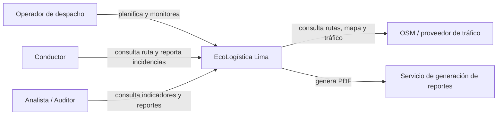
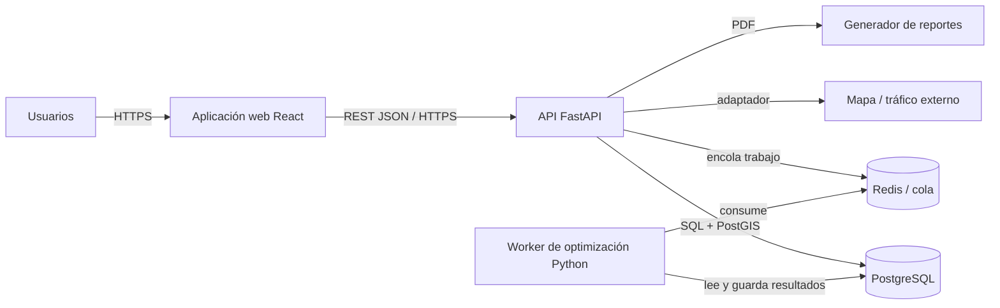
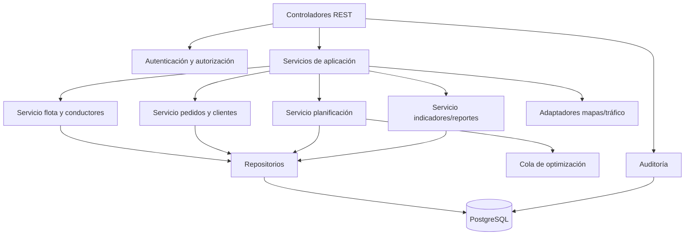
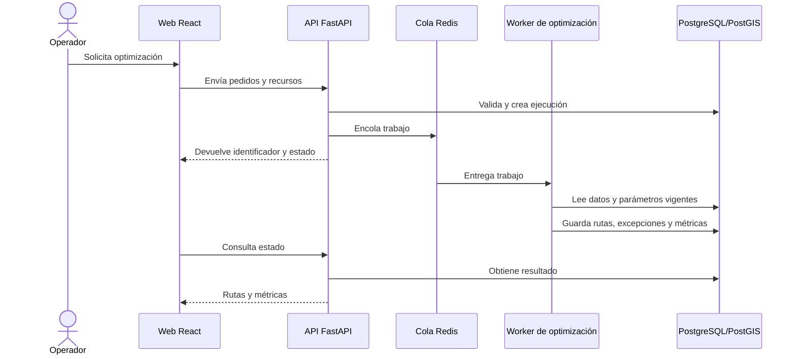

# Arquitectura de software — Modelo C4

| Metadato | Valor |
|---|---|
| Proyecto | EcoLogística Lima |
| Versión | 1.0.0 |
| Fecha | 04/09/2026 |

## Decisiones y atributos arquitectónicos

La arquitectura separa experiencia web, API de dominio, procesamiento de optimización y almacenamiento para soportar rendimiento, disponibilidad, seguridad y evolución de las reglas. Las integraciones externas se consumen mediante adaptadores; una indisponibilidad no debe impedir ver rutas con información previamente disponible.

## Nivel 1 — Contexto

## Nivel 2 — Contenedores

| Contenedor | Tecnología | Responsabilidad |
|---|---|---|
| Aplicación web | React/TypeScript | Experiencia de despacho, administración, modo conductor y accesibilidad. |
| API | FastAPI | Autenticación, RBAC, validación, casos de uso y OpenAPI. |
| Worker | Python | Ejecuta metaheurística, reintentos y persistencia de resultados. |
| Base de datos | PostgreSQL/PostGIS | Datos del dominio, auditoría y geodatos. |
| Cola/caché | Redis | Desacopla cálculos y limita reintentos. |

## Nivel 3 — Componentes de la API

## Flujos críticos

1. El Operador envía pedidos y recursos al servicio de planificación.
2. La API valida permisos, datos y reglas; crea una optimización reproducible y la encola.
3. El worker obtiene parámetros vigentes, calcula una solución y persiste rutas, excepciones y métricas.
4. La web consulta el estado, muestra mapa/datos con hora de fuente y permite la decisión final del operador.

## Seguridad y operación

HTTPS termina en el borde de la aplicación; secretos se gestionan fuera del repositorio. La API valida esquemas, aplica mínimo privilegio y registra acciones relevantes. Las métricas incluyen latencia P95, duración de trabajos, errores, disponibilidad y consultas lentas. Las copias de seguridad y la restauración se verifican antes de liberar el MVP.
