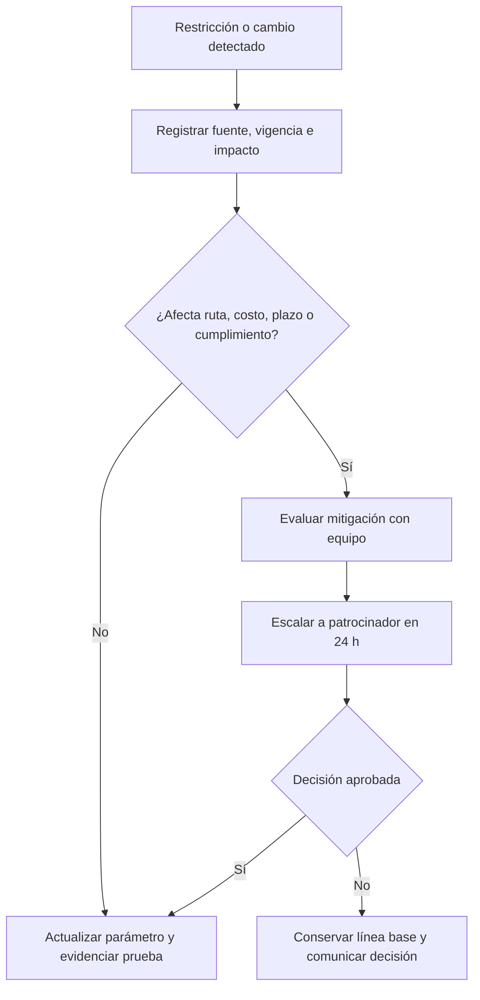

# Análisis multidimensional de restricciones

| Metadato | Valor |
|---|---|
| Proyecto | EcoLogística Lima |
| Versión | 1.0.0 |
| Fecha | 04/09/2026 |

## Matriz de impacto, mitigación y cumplimiento

| Dimensión | Restricción y contexto Lima | Impacto | Estrategia de mitigación / diseño | Evidencia |
|---|---|---|---|---|
| Costo del ciclo de vida | El TCO incluye combustible diésel de referencia S/ 17.50/galón, mantenimiento S/ 1.20/km, seguros, depreciación y operación. | Alto | Parametrizar costos y comparar escenario diésel, GNV y ruta optimizada a tres años; no presentar estimaciones como valores reales sin fecha/fuente. | Reporte de costos y versión de parámetros. |
| Presupuesto | MVP tiene presupuesto inicial S/ 500,000 y costo operativo anual referencial S/ 120,000. | Alto | Priorizar RF-01 a RF-07, software abierto, presupuestos por hito y control de cambios. | Línea base y registro de cambios. |
| Carbono neto | Objetivo de carbono neutral en tres años con reducción, migración tecnológica y compensación. | Alto | Medir primero, reducir km/consumo, modelar escenarios y diferenciar compensación propuesta de crédito certificado. | Reporte anual CO₂ y factores. |
| Ambiental | Evitar o penalizar áreas sensibles, hospitales, colegios, parques y zonas de ruido en horarios configurados. | Alto | Capa geográfica parametrizable; revisión humana para restricciones no verificadas. | Capas, reglas y pruebas de ruta. |
| Social y laboral | Jornada máxima de conducción, descansos, seguridad y participación de conductores. | Alto | Reglas de jornada, descansos y canal de incidencias; pruebas de usabilidad con modo conductor. | Casos de prueba y actas de validación. |
| Cultural y accesibilidad | Español peruano, iconos comprensibles, alto contraste y conectividad 2G/3G posible. | Alto | Textos claros, iconos con etiqueta, WCAG 2.1 AA, modo de bajo consumo y última ruta disponible. | Auditoría WCAG y pruebas offline. |
| Normativa y privacidad | Ley 29733, normas MTC y reglas de circulación aplicables. | Alto | Minimización de datos, RBAC, auditoría, consentimiento cuando corresponda y parámetros versionados de restricción vial. | Matriz de acceso, log y revisión legal. |
| Datos | Direcciones no estandarizadas y tráfico de precisión/cobertura variable. | Alto | Permitir coordenadas y referencias, validar calidad, mostrar fuente/hora y aceptar carga manual de incidencia. | Porcentaje de geocodificación y pruebas degradadas. |
| Seguridad vial | Riesgo de robos y accidentes en zonas específicas. | Alto | Alertas y penalizaciones configurables; el operador valida antes de bloquear una vía. | Registro de alertas e incidencia. |
| Climática | Neblina y humedad de junio a setiembre afectan visibilidad. | Medio | Configurar penalización por horario/zona y sugerir rutas iluminadas si existe dato confiable. | Parámetro de temporada y escenario de prueba. |
| Infraestructura vial | Calles no pavimentadas o estrechas limitan vehículos pesados. | Alto | Clasificar vía y compatibilidad de vehículo; registrar restricciones locales. | Datos de vía y prueba de factibilidad. |
| Tecnológica | Se exige código abierto: Python, React/Vue, PostgreSQL y Leaflet/OSM o API de pago. | Medio | Stack seleccionado con adaptadores, caché y proveedor alterno. | ADR de stack y pruebas de integración. |
| Calidad y estándares | W3C, ISO/IEC 25010, OWASP Top 10, Green Software, WCAG 2.1 e ISO 14083. | Alto | RNF medibles, pruebas automatizadas/manuales, métricas de emisión y revisión de accesibilidad. | Informe de calidad y plan de pruebas. |

## Análisis de factibilidad

| Tipo | Conclusión | Condición de éxito |
|---|---|---|
| Técnica | Factible para MVP con instancia acotada de 150 pedidos/15 vehículos y un motor desacoplado. | Prototipar la metaheurística desde la iteración 2 y medir P95 ≤45 s. |
| Operativa | Factible si despacho y conductores validan reglas, explicaciones y modo conductor. | Sesiones quincenales de revisión y registro de excepciones. |
| Económica | Factible dentro del presupuesto referencial si se prioriza el MVP y se usan servicios con límites controlados. | Seguimiento por hito y alerta ante desviación >10%. |
| Legal/ética | Factible con datos minimizados, roles y controles de auditoría. | No usar datos reales de prueba sin base legítima y protección adecuada. |

## Control y escalamiento

Una restricción nueva o un dato que invalide una ruta se registra como incidencia y se evalúa en 24 horas por el director del proyecto y el patrocinador. Los cambios de costo, factor de emisión, zona o norma requieren fuente, vigencia, responsable y prueba de regresión antes de entrar en operación.
