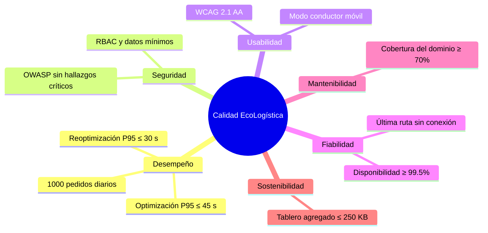

# Requisitos no funcionales

| Metadato | Valor |
|---|---|
| Proyecto | EcoLogística Lima |
| Versión | 1.0.0 |
| Fecha | 04/09/2026 |

Los escenarios siguen ISO/IEC 25010 y arc42. Las mediciones se ejecutarán sobre un entorno de prueba representativo y quedarán registradas con fecha, conjunto de datos y resultado.

| ID | Categoría ISO 25010 | Escenario de calidad y medida SMART | Verificación |
|---|---|---|---|
| RNF-001 | Eficiencia de desempeño | **Fuente:** Operador. **Estímulo:** solicita optimización de hasta 150 pedidos y 15 vehículos. **Entorno:** carga normal. **Artefacto:** motor de rutas. **Respuesta:** devuelve solución factible o pedidos no asignados. **Medida:** termina en ≤45 s en el percentil 95 de 30 ejecuciones. | Prueba de rendimiento con semilla y datos fijos. |
| RNF-002 | Eficiencia de desempeño | **Fuente:** Operador. **Estímulo:** registra una incidencia durante operación. **Entorno:** hasta 50 pedidos pendientes. **Artefacto:** reoptimizador. **Respuesta:** recalcula rutas pendientes. **Medida:** respuesta ≤30 s en P95 de 30 ejecuciones. | Prueba automatizada de reoptimización. |
| RNF-003 | Seguridad | **Fuente:** atacante externo. **Estímulo:** intenta inyección, XSS, CSRF o acceso sin autorización. **Entorno:** aplicación desplegada. **Artefacto:** API y web. **Respuesta:** bloquea solicitud, conserva datos y audita evento. **Medida:** 0 vulnerabilidades críticas o altas explotables en análisis OWASP previo a entrega. | SAST, pruebas de autorización y checklist OWASP. |
| RNF-004 | Seguridad | **Fuente:** usuario autorizado. **Estímulo:** consulta datos personales. **Entorno:** operación normal. **Artefacto:** API y base de datos. **Respuesta:** entrega solo campos permitidos por rol. **Medida:** 100% de 20 pruebas RBAC sin exposición de DNI/contacto a rol Conductor ajeno o Auditor. | Casos de prueba de permisos y revisión de logs. |
| RNF-005 | Usabilidad y accesibilidad | **Fuente:** conductor con alfabetización digital básica. **Estímulo:** consulta su ruta. **Entorno:** móvil de 360 px. **Artefacto:** modo conductor. **Respuesta:** presenta siguiente parada y alerta sin desplazamiento horizontal. **Medida:** 8 de 10 tareas completadas por ≥80% de participantes de prueba y contraste ≥4.5:1. | Prueba de usabilidad y auditoría WCAG 2.1 AA. |
| RNF-006 | Fiabilidad / disponibilidad | **Fuente:** falla de conectividad. **Estímulo:** dispositivo pierde red. **Entorno:** jornada de reparto. **Artefacto:** interfaz móvil. **Respuesta:** conserva último itinerario y cola el reporte. **Medida:** 100% de 10 pruebas conserva la última ruta y sincroniza al restituirse la red. | Prueba manual en modo offline simulado. |
| RNF-007 | Disponibilidad | **Fuente:** usuario operativo. **Estímulo:** accede en horario 05:00–22:00. **Entorno:** operación mensual. **Artefacto:** plataforma. **Respuesta:** atiende solicitudes. **Medida:** disponibilidad mensual ≥99.5%, excluyendo mantenimientos anunciados. | Monitoreo de disponibilidad y bitácora. |
| RNF-008 | Capacidad | **Fuente:** operación en crecimiento. **Estímulo:** se cargan 1,000 pedidos diarios y 50 vehículos. **Entorno:** prueba de carga. **Artefacto:** API y base de datos. **Respuesta:** registra pedidos y consulta tablero. **Medida:** P95 de registro ≤2 s y errores 5xx <1% en 100 solicitudes concurrentes. | Prueba de carga documentada. |
| RNF-009 | Compatibilidad | **Fuente:** usuarios con navegador de bajo costo. **Estímulo:** abre la aplicación. **Entorno:** versiones soportadas de Chrome y Firefox. **Artefacto:** cliente web. **Respuesta:** permite las funciones principales. **Medida:** 100% de 15 pruebas de flujo crítico aprobadas en las dos versiones definidas. | Matriz de compatibilidad. |
| RNF-010 | Mantenibilidad | **Fuente:** desarrollador. **Estímulo:** modifica una regla parametrizable. **Entorno:** mantenimiento. **Artefacto:** servicio de reglas. **Respuesta:** aplica cambio con pruebas. **Medida:** cobertura de pruebas del dominio ≥70% y pipeline ejecuta pruebas antes de integrar cambios. | Reporte de cobertura y CI. |
| RNF-011 | Adecuación funcional | **Fuente:** analista. **Estímulo:** compara cálculo de CO₂ y costo. **Entorno:** reporte. **Artefacto:** módulo de indicadores. **Respuesta:** usa parámetros versionados. **Medida:** diferencia absoluta ≤0.01 frente a 20 cálculos de referencia. | Casos de prueba con hoja de cálculo. |
| RNF-012 | Sostenibilidad | **Fuente:** sistema. **Estímulo:** consulta de tablero o reporte. **Entorno:** operación normal. **Artefacto:** API y BD. **Respuesta:** evita transferencia innecesaria. **Medida:** respuesta del tablero agregado ≤250 KB sin incluir mapa y consultas indexadas revisadas antes de entrega. | Inspector de red y plan de consultas. |
| RNF-013 | Portabilidad / documentación | **Fuente:** administrador nuevo. **Estímulo:** instala y configura un entorno. **Entorno:** equipo limpio. **Artefacto:** repositorio. **Respuesta:** levanta servicios y consulta OpenAPI. **Medida:** instalación reproducible en ≤60 min siguiendo README, manual admin y OpenAPI. | Prueba de instalación independiente. |

## Cumplimiento transversal

- La interfaz estará en español peruano claro, con iconos y textos que no dependan solo del color.
- Los datos se cifrarán en tránsito mediante HTTPS; las credenciales no se almacenarán en texto plano.
- La documentación incluirá manual de usuario, administrador, API, arquitectura y contingencia operativa.
- Los valores de tráfico son informativos: se mostrará la fuente y hora de actualización para evitar decisiones basadas en datos obsoletos.
