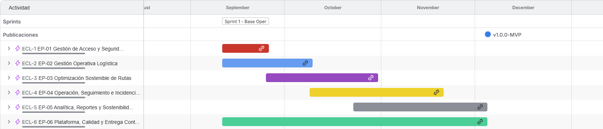
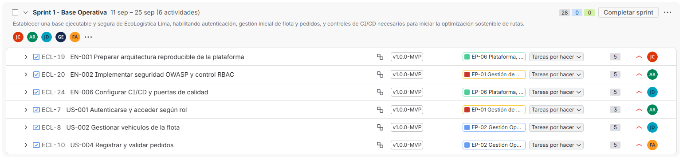
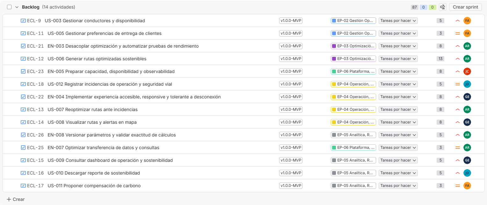
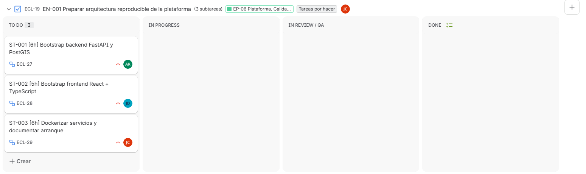
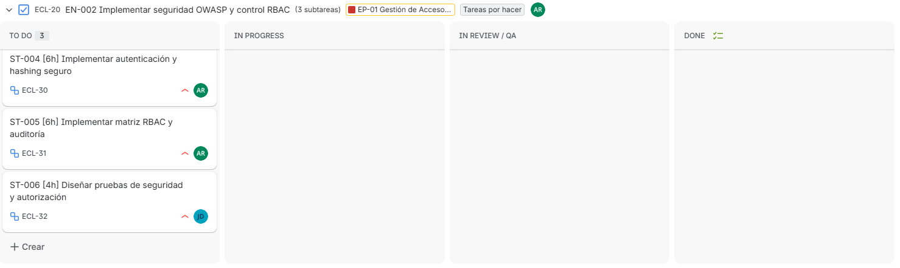
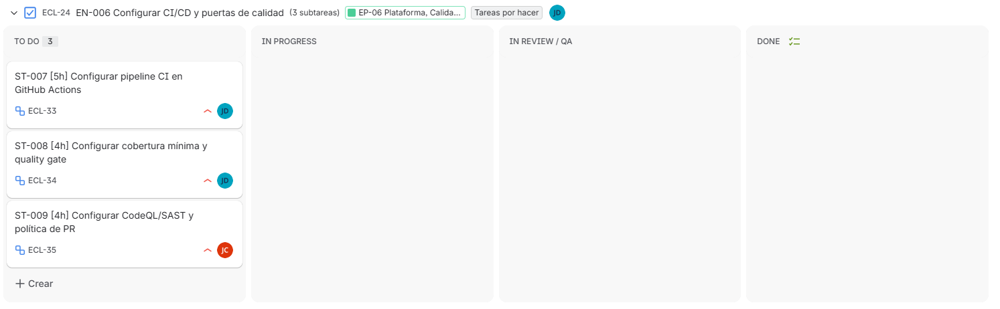
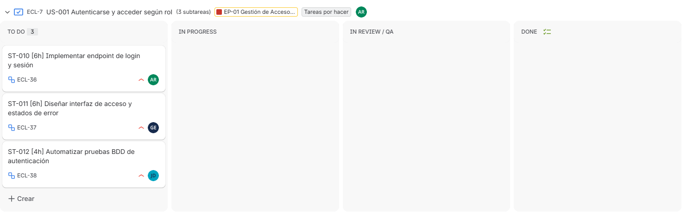
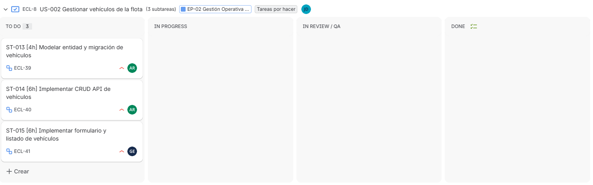
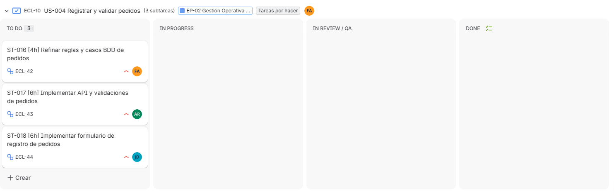
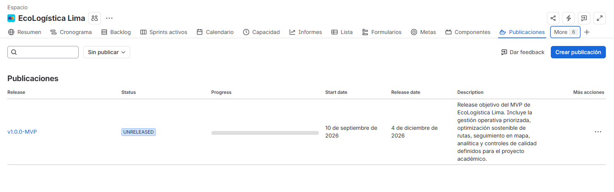

# Artefactos Jira — EcoLogística Lima

- [Volver ->](</README.md>)

| Metadato | Valor |
|---|---|
| Proyecto Jira | EcoLogística Lima (`ECL`) |
| Tipo de proyecto | Company-managed Software |
| Board | `ECL board` — Scrum, Board ID 3 |
| Versión | 1.0.0 |
| Fecha | 11/09/2026 |

## 1. Configuración operativa validada

La configuración del proyecto fue validada directamente en Jira y utiliza el campo **Story Points** como métrica de estimación del Board. El backlog ejecutable contiene **12 Historias (68 SP) + 8 Enablers (47 SP) = 115 SP**.

### Jerarquía de trabajo

| Tipo Jira | Uso en EcoLogística Lima | Regla |
|---|---|---|
| Epic | Módulo o bloque funcional mayor | Contiene Historias o Enablers relacionados. |
| Historia | Funcionalidad con valor para usuario final | Formato Como/quiero/para + BDD. |
| Tarea | Enabler técnico | Arquitectura, seguridad, DevOps, rendimiento o datos. |
| Subtarea | Unidad técnica del Sprint | Duración máxima ≤8 h. |
| Error | Incidencia/defecto | Se registra durante o al cierre de un Sprint. |

### Componentes

| Componente | Alcance |
|---|---|
| Seguridad y Acceso | Autenticación, autorización, RBAC y protección de datos. |
| Gestión Operativa | Flota, conductores, pedidos y clientes. |
| Optimización | VRPTW / Green VRP, worker y benchmarks. |
| Seguimiento y Mapas | Mapa, incidencias, reoptimización y experiencia de conductor. |
| Analítica y Sostenibilidad | Dashboard, reportes, carbono y parámetros. |
| Plataforma / DevOps | Arquitectura, CI/CD, capacidad, observabilidad y Green Software. |

## 2. Product Backlog priorizado

El ranking se definió por dependencia técnica, riesgo y valor de negocio. El orden actual en Jira es:

| Rank | Jira | Elemento | Tipo | SP | Prioridad | Componente | Responsable |
|---:|---|---|---|---:|---|---|---|
| 1 | ECL-19 | EN-001 — Preparar arquitectura reproducible de la plataforma | Enabler | 5 | Alta | Plataforma / DevOps | Julio Armando Naupari Camarena |
| 2 | ECL-20 | EN-002 — Implementar seguridad OWASP y control RBAC | Enabler | 5 | Alta | Seguridad y Acceso | Antony Munive Ríos |
| 3 | ECL-24 | EN-006 — Configurar CI/CD y puertas de calidad | Enabler | 5 | Alta | Plataforma / DevOps | José Samuel Delgadillo Pantoja |
| 4 | ECL-7 | US-001 — Autenticarse y acceder según rol | Historia | 3 | Alta | Seguridad y Acceso | Antony Munive Ríos |
| 5 | ECL-8 | US-002 — Gestionar vehículos de la flota | Historia | 5 | Alta | Gestión Operativa | José Samuel Delgadillo Pantoja |
| 6 | ECL-10 | US-004 — Registrar y validar pedidos | Historia | 5 | Alta | Gestión Operativa | Frank Roy Yupanqui Acevedo |
| 7 | ECL-9 | US-003 — Gestionar conductores y disponibilidad | Historia | 5 | Alta | Gestión Operativa | Frank Roy Yupanqui Acevedo |
| 8 | ECL-11 | US-005 — Gestionar preferencias de entrega de clientes | Historia | 3 | Media | Gestión Operativa | Frank Roy Yupanqui Acevedo |
| 9 | ECL-21 | EN-003 — Desacoplar optimización y automatizar pruebas de rendimiento | Enabler | 8 | Alta | Optimización | Antony Munive Ríos |
| 10 | ECL-12 | US-006 — Generar rutas optimizadas sostenibles | Historia | 13 | Alta | Optimización | Antony Munive Ríos |
| 11 | ECL-23 | EN-005 — Preparar capacidad, disponibilidad y observabilidad | Enabler | 8 | Alta | Plataforma / DevOps | Julio Armando Naupari Camarena |
| 12 | ECL-18 | US-012 — Registrar incidencias de operación y seguridad vial | Historia | 5 | Media | Seguimiento y Mapas | José Samuel Delgadillo Pantoja |
| 13 | ECL-22 | EN-004 — Implementar experiencia accesible, responsive y tolerante a desconexión | Enabler | 8 | Alta | Seguimiento y Mapas | Giancarlo Marcio Soto Escobar |
| 14 | ECL-13 | US-007 — Reoptimizar rutas ante incidencias | Historia | 8 | Alta | Seguimiento y Mapas | Antony Munive Ríos |
| 15 | ECL-14 | US-008 — Visualizar rutas y alertas en mapa | Historia | 8 | Alta | Seguimiento y Mapas | Giancarlo Marcio Soto Escobar |
| 16 | ECL-26 | EN-008 — Versionar parámetros y validar exactitud de cálculos | Enabler | 5 | Alta | Analítica y Sostenibilidad | Antony Munive Ríos |
| 17 | ECL-25 | EN-007 — Optimizar transferencia de datos y consultas | Enabler | 3 | Media | Plataforma / DevOps | Antony Munive Ríos |
| 18 | ECL-15 | US-009 — Consultar dashboard de operación y sostenibilidad | Historia | 5 | Alta | Analítica y Sostenibilidad | Giancarlo Marcio Soto Escobar |
| 19 | ECL-16 | US-010 — Descargar reporte de sostenibilidad | Historia | 5 | Alta | Analítica y Sostenibilidad | José Samuel Delgadillo Pantoja |
| 20 | ECL-17 | US-011 — Proponer compensación de carbono | Historia | 3 | Media | Analítica y Sostenibilidad | Frank Roy Yupanqui Acevedo |

## 3. Roadmap de Épicas

| Épica | Jira | Responsable | Inicio | Fin | Resultado esperado |
|---|---|---|---|---|---|
| EP-01 — Gestión de Acceso y Seguridad | ECL-1 | Antony Munive Ríos | 2026-09-11 | 2026-10-02 | Acceso y controles de seguridad habilitados. |
| EP-02 — Gestión Operativa Logística | ECL-2 | Frank Roy Yupanqui Acevedo | 2026-09-11 | 2026-10-16 | Datos operativos listos para optimización. |
| EP-03 — Optimización Sostenible de Rutas | ECL-3 | Antony Munive Ríos | 2026-09-25 | 2026-11-13 | Optimización sostenible factible y medible. |
| EP-04 — Operación, Seguimiento e Incidencias | ECL-4 | José Samuel Delgadillo Pantoja | 2026-10-09 | 2026-11-27 | Seguimiento, incidencias y reoptimización operativos. |
| EP-05 — Analítica, Reportes y Sostenibilidad | ECL-5 | Giancarlo Marcio Soto Escobar | 2026-10-23 | 2026-12-04 | Indicadores, reportes y sostenibilidad trazables. |
| EP-06 — Plataforma, Calidad y Entrega Continua | ECL-6 | Julio Armando Naupari Camarena | 2026-09-11 | 2026-12-04 | Base técnica, calidad y entrega continua disponibles. |

## 4. Release

| Campo | Configuración |
|---|---|
| Versión | `v1.0.0-MVP` |
| Inicio | 10/09/2026 |
| Fecha objetivo de release | 04/12/2026 |
| Estado | Unreleased / no archivada |
| Alcance | 20 elementos ejecutables: 12 Historias + 8 Enablers |

La Release consolida gestión operativa, optimización VRPTW/Green VRP, seguimiento en mapa, analítica y controles de calidad del MVP.

## 5. Sprint 1 — Base Operativa

| Campo | Valor |
|---|---|
| Sprint ID | 4 |
| Duración | 2 semanas |
| Inicio | 11/09/2026 09:00 (America/Lima) |
| Fin | 25/09/2026 09:00 (America/Lima) |
| Estado al generar este documento | Active / iniciado |

**Sprint Goal:** Establecer una base ejecutable y segura de EcoLogística Lima, habilitando autenticación, gestión inicial de flota y pedidos, y controles de CI/CD necesarios para iniciar la optimización sostenible de rutas.

### Ítems comprometidos

| Jira | Elemento | SP | Responsable |
|---|---|---:|---|
| ECL-19 | EN-001 — Preparar arquitectura reproducible de la plataforma | 5 | Julio Armando Naupari Camarena |
| ECL-20 | EN-002 — Implementar seguridad OWASP y control RBAC | 5 | Antony Munive Ríos |
| ECL-24 | EN-006 — Configurar CI/CD y puertas de calidad | 5 | José Samuel Delgadillo Pantoja |
| ECL-7 | US-001 — Autenticarse y acceder según rol | 3 | Antony Munive Ríos |
| ECL-8 | US-002 — Gestionar vehículos de la flota | 5 | José Samuel Delgadillo Pantoja |
| ECL-10 | US-004 — Registrar y validar pedidos | 5 | Frank Roy Yupanqui Acevedo |
|  | **Total Sprint 1** | **28 SP** |  |

### Subtareas técnicas del Sprint 1

| Jira | Padre | ID | Subtarea | Estimación | Responsable |
|---|---|---|---|---:|---|
| ECL-27 | ECL-19 | ST-001 | Bootstrap backend FastAPI y PostGIS | 6 h | Antony Munive Ríos |
| ECL-28 | ECL-19 | ST-002 | Bootstrap frontend React + TypeScript | 5 h | José Samuel Delgadillo Pantoja |
| ECL-29 | ECL-19 | ST-003 | Dockerizar servicios y documentar arranque | 6 h | Julio Armando Naupari Camarena |
| ECL-30 | ECL-20 | ST-004 | Implementar autenticación y hashing seguro | 6 h | Antony Munive Ríos |
| ECL-31 | ECL-20 | ST-005 | Implementar matriz RBAC y auditoría | 6 h | Antony Munive Ríos |
| ECL-32 | ECL-20 | ST-006 | Diseñar pruebas de seguridad y autorización | 4 h | José Samuel Delgadillo Pantoja |
| ECL-33 | ECL-24 | ST-007 | Configurar pipeline CI en GitHub Actions | 5 h | José Samuel Delgadillo Pantoja |
| ECL-34 | ECL-24 | ST-008 | Configurar cobertura mínima y quality gate | 4 h | José Samuel Delgadillo Pantoja |
| ECL-35 | ECL-24 | ST-009 | Configurar CodeQL/SAST y política de PR | 4 h | Julio Armando Naupari Camarena |
| ECL-36 | ECL-7 | ST-010 | Implementar endpoint de login y sesión | 6 h | Antony Munive Ríos |
| ECL-37 | ECL-7 | ST-011 | Diseñar interfaz de acceso y estados de error | 6 h | Giancarlo Marcio Soto Escobar |
| ECL-38 | ECL-7 | ST-012 | Automatizar pruebas BDD de autenticación | 4 h | José Samuel Delgadillo Pantoja |
| ECL-39 | ECL-8 | ST-013 | Modelar entidad y migración de vehículos | 4 h | Antony Munive Ríos |
| ECL-40 | ECL-8 | ST-014 | Implementar CRUD API de vehículos | 6 h | Antony Munive Ríos |
| ECL-41 | ECL-8 | ST-015 | Implementar formulario y listado de vehículos | 6 h | Giancarlo Marcio Soto Escobar |
| ECL-42 | ECL-10 | ST-016 | Refinar reglas y casos BDD de pedidos | 4 h | Frank Roy Yupanqui Acevedo |
| ECL-43 | ECL-10 | ST-017 | Implementar API y validaciones de pedidos | 6 h | Antony Munive Ríos |
| ECL-44 | ECL-10 | ST-018 | Implementar formulario de registro de pedidos | 6 h | José Samuel Delgadillo Pantoja |

> Todas las subtareas son ≤8 horas, cumpliendo la granularidad definida para el trabajo técnico.

## 6. Board Scrum

El flujo configurado en `ECL board` es:

`To Do → In Progress → In Review / QA → Done`

El Board usa `Story Points (customfield_10037)` para estimación y `Rank` para el orden del backlog.

## 7. Evidencias visuales de Jira

> **Fecha de evidencias:** 11/09/2026.  
> Las capturas se recortaron al área funcional de Jira para evitar escritorio, barra de tareas y pestañas del navegador. Las imágenes se encuentran en `evidencias-jira/` y se referencian mediante rutas relativas para que se rendericen directamente en GitHub.

### Evidencia 1 — Roadmap / Cronograma de Épicas

La vista de cronograma muestra las seis Épicas del proyecto, sus periodos de ejecución, el Sprint 1 y el hito de la versión `v1.0.0-MVP`.

**Elementos observables:**
- `ECL-1` — EP-01 Gestión de Acceso y Seguridad.
- `ECL-2` — EP-02 Gestión Operativa Logística.
- `ECL-3` — EP-03 Optimización Sostenible de Rutas.
- `ECL-4` — EP-04 Operación, Seguimiento e Incidencias.
- `ECL-5` — EP-05 Analítica, Reportes y Sostenibilidad.
- `ECL-6` — EP-06 Plataforma, Calidad y Entrega Continua.
- Hito de Release `v1.0.0-MVP`.

### Evidencia 2 — Product Backlog priorizado

La vista del Backlog registra los elementos pendientes fuera del Sprint activo, manteniendo el orden de prioridad definido. Se observan las estimaciones Fibonacci y la asociación de los elementos con sus Épicas.

El Backlog restante muestra **14 actividades y 87 SP**. Los otros **6 elementos y 28 SP** se encuentran comprometidos en el Sprint 1, por lo que el total de trabajo estimado del Product Backlog ejecutable continúa siendo **115 SP**.

> **Nota de trazabilidad:** la asignación de Componentes se documenta en la tabla de la sección 2 de este archivo y está configurada en Jira para los 20 elementos ejecutables.

### Evidencia 3 — Sprint 1 activo, Sprint Goal y compromiso

El Sprint 1 se encuentra iniciado con seis elementos padre, fechas del 11 al 25 de septiembre de 2026 y un compromiso total de **28 Story Points**.

**Sprint Goal:** Establecer una base ejecutable y segura de EcoLogística Lima, habilitando autenticación, gestión inicial de flota y pedidos, y controles de CI/CD necesarios para iniciar la optimización sostenible de rutas.

La captura evidencia además que Jira ofrece la acción **Completar sprint**, confirmando que el Sprint se encuentra activo.

### Evidencia 4 — Tablero Scrum activo

El tablero activo utiliza las cuatro columnas definidas para el flujo de trabajo:

`To Do → In Progress → In Review / QA → Done`

Al momento de tomar las evidencias, el Sprint acababa de iniciarse y las subtareas se encontraban legítimamente en **To Do**. Por esta razón no se trasladaron tarjetas artificialmente a otros estados únicamente para la captura.

#### 4.1 EN-001 — Arquitectura reproducible

#### 4.2 EN-002 — Seguridad OWASP y RBAC

#### 4.3 EN-006 — CI/CD y puertas de calidad

#### 4.4 US-001 — Autenticación y acceso por rol

#### 4.5 US-002 — Gestión de vehículos

#### 4.6 US-004 — Registro y validación de pedidos

Estas seis vistas corresponden a los seis elementos padre comprometidos en Sprint 1 y muestran sus 18 subtareas distribuidas por responsable.

### Evidencia 5 — Gestión de Versiones / Release

La versión oficial del MVP se encuentra creada en Jira como `v1.0.0-MVP`, con fecha de inicio 10/09/2026 y fecha objetivo de Release 04/12/2026.

La Release se mantiene en estado **UNRELEASED** durante el desarrollo y consolida el alcance del MVP de EcoLogística Lima.

## 8. Checklist de evidencia para entrega

- [x] Roadmap real recortado y legible.
- [x] Backlog priorizado con Story Points visibles.
- [x] Sprint 1 iniciado, con Sprint Goal explícito y 28 SP.
- [x] Tablero Scrum activo con las cuatro columnas configuradas.
- [x] Release `v1.0.0-MVP` visible con fechas y descripción.
- [x] Capturas almacenadas en `evidencias-jira/` y enlazadas mediante rutas relativas.
- [x] Evidencias sin escritorio, taskbar ni pestañas del navegador.

> **Observación:** el Sprint fue capturado en su estado inicial; por integridad de la evidencia no se simuló avance. Conforme el equipo ejecute las subtareas, las tarjetas deberán desplazarse por el flujo según su estado real.

[← Volver al README Principal](../../README.md)
