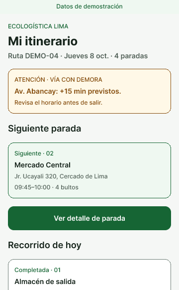
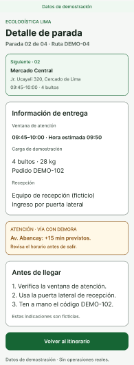
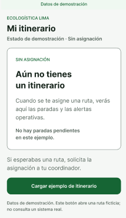
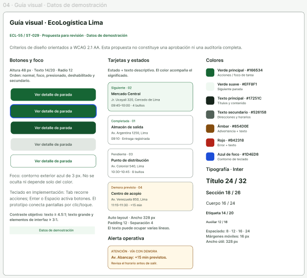

# Evidencias visuales de ST-029

Las cuatro imágenes se conservan como **vistas del diseño**, según la preferencia
del usuario. Pueden estar reducidas o mostrar parte de una pantalla; el diseño
completo y sus conexiones se consultan en el archivo editable de Figma.

Los nombres se conservan. El sufijo `360` identifica la propuesta de pantalla
móvil, no garantiza que el PNG tenga ese ancho:

| Archivo | Frame fuente | Imagen recibida | Observación |
|---|---|---|---|
| `01-mi-itinerario-360.png` | `5:125` — Mi itinerario | 360 × 582 px | Vista parcial: el recorrido continúa en Figma. |
| `02-detalle-parada-360.png` | `5:163` — Detalle de parada | 195 × 530 px | Vista reducida de la pantalla. |
| `03-sin-itinerario-360.png` | `5:194` — Sin itinerario asignado | 214 × 369 px | Vista reducida del estado sin asignación. |
| `04-guia-visual.png` | `5:21` — Guía visual | 619 × 561 px | Vista de la guía de componentes. |

## Vistas

La comprobación de adaptación a 360 px se realiza sobre los frames de Figma,
separadamente de estas vistas PNG. Estado: propuesta sin aprobación del equipo.
