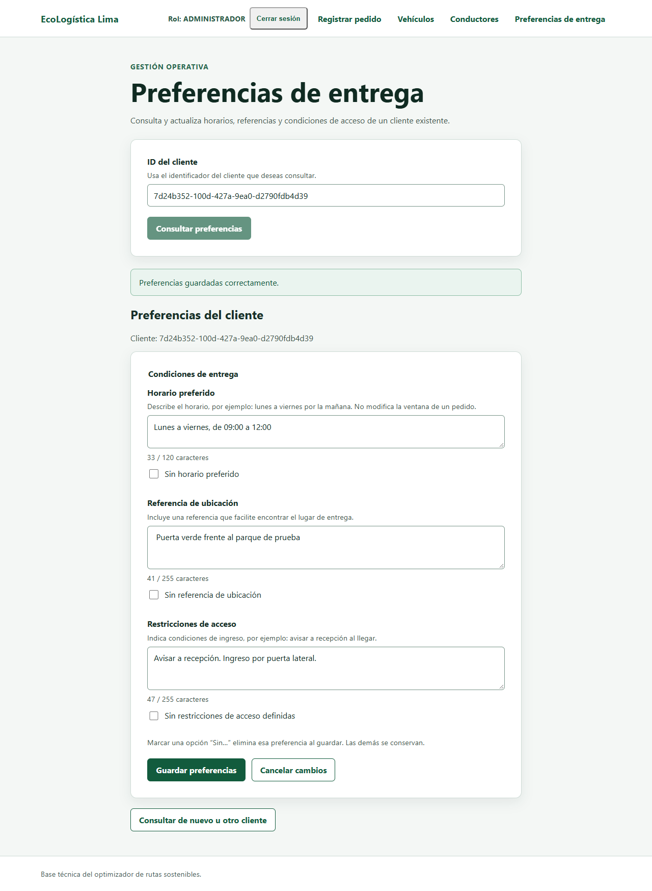
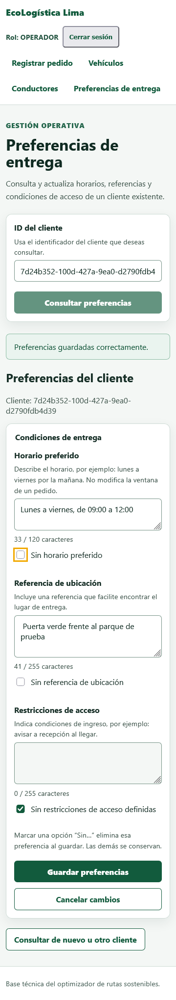

# Capturas y evidencia — ST-027 / ECL-53

Fecha: 09/10/2026, America/Lima. Todos los clientes y cuentas son sintéticos.
Login, GET/PATCH, persistencia, aislamiento entre clientes y denegación de
Conductor se comprobaron contra la API y PostgreSQL reales del entorno temporal.
El error 503 fue simulado explícitamente para comprobar la interfaz.

[Reporte técnico](../../VALIDACION_ST027.md) ·
[Resultados de navegador](resultados.json) · [JUnit frontend](frontend-tests.xml).

El XML conserva los 431 casos aprobados de la ejecución local. Se retiraron
únicamente rutas absolutas y hostname del equipo al preparar la copia para Git.

| Caso | Chrome | Firefox |
|---|---|---|
| Cliente sin preferencias | [Captura](chrome-01-sin-preferencias.png) | [Captura](firefox-01-sin-preferencias.png) |
| Guardado confirmado | [Captura](chrome-02-guardado.png) | [Captura](firefox-02-guardado.png) |
| Recuperación por GET | [Captura](chrome-03-recuperado.png) | [Captura](firefox-03-recuperado.png) |
| Error de longitud | [Captura](chrome-04-validacion.png) | [Captura](firefox-04-validacion.png) |
| Formulario a 360 px | [Captura](chrome-05-movil-360.png) | [Captura](firefox-05-movil-360.png) |
| Error 503 simulado | [Captura](chrome-06-error-503.png) | [Captura](firefox-06-error-503.png) |
| Cliente inexistente, 404 real | [Captura](chrome-07-cliente-inexistente.png) | [Captura](firefox-07-cliente-inexistente.png) |
| Conductor sin permiso | [Captura](chrome-08-acceso-denegado.png) | [Captura](firefox-08-acceso-denegado.png) |

## Guardado confirmado

## Vista móvil

